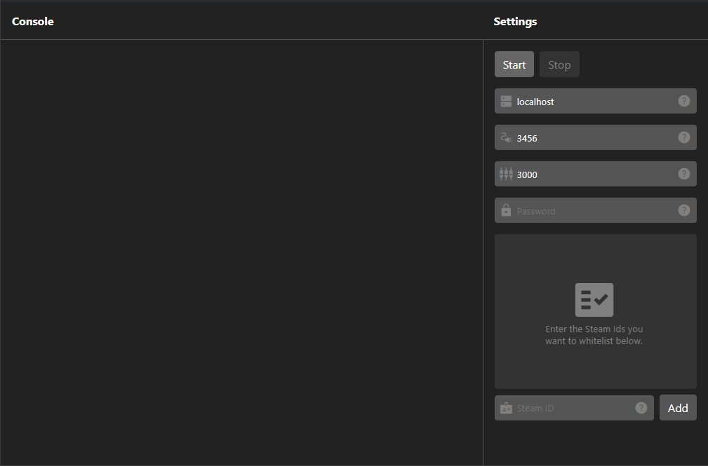

# GalacticComms Voice Server
This repository holds the source code for the voice server for the GalacticComms Voice Plugin for [Space Engineers](https://www.spaceengineersgame.com/).

Its role is to mediate and control access and connections between peers on the voice network.

This is one of three parts that make up the system and should be installed on the **server side**.

The other parts can be found here:
- [The Torch Plugin](https://github.com/argonkoda/galactic-comms-plugin)
- [The Voice Server (This Repo)](https://github.com/argonkoda/galactic-comms-server)
- [The Voice Client](https://github.com/argonkoda/galactic-comms-client)

## Installation
For most users you'll just want to install the program. To do that just follow the steps below. For those who are interested in helping or have a bug to report check out [CONTRIBUTING.md]('./CONTRIBUTING.md).

> Note: This system is only available for Windows PC at the moment. This is mostly because Space Engineers is also Windows only. If someone wants to configure MacOS or Linux builds for the server or client, open an issue in the relevant repo. Unfortunately XBox support is unlikely due to the nature of modding and the permissions required for microphone access etc. 

1. To start you'll want to grab the latest release from the [Releases Page](https://github.com/argonkoda/galactic-comms-server/releases). To do that find the latest release and download the `GalacticComms Voice Server.zip` file.
2. Extract the contents into a folder where you want to store the program.
3. You can open the server UI by running `GalacticComms Voice Server.exe`.

## Setup
Once the server is installed you can begin configuring the server. Before you begin make sure you have a dedicated server set up with the plugin installed. Instructions for that can be found in the [Plugin Repo](https://github.com/argonkoda/galactic-comms-plugin).

Open the server by running `GalacticComms Voice Server.exe`. You should see a screen like the one below:  

  

There are two main sections, the Console and the Settings Panel

The console will show the list of messages the server generates while running. This will include informational messages to error messages.

The settings panel allows you to configure the server. They will be readonly while the server is running as they all require a server restart.

From top to bottom they are:
- **Game Server Hostname**: This is the hostname of the machine the game server is running on. If you are running the voice server on the same machine as the game server then this will just be `localhost`.
- **Plugin Port**: This is the port the plugin is configured to run on. The default `3456` should work for everyone.
- **Server Port**: This is the port the voice server will operate on and the port that clients will connect to. You can set this to anything, but you will need to make sure it is free and open to the internet.
  > **Warning**: Opening ports for internet access comes with risks. Make sure you understand those risks before continuing.
- **Password**: This is the password clients will use to authenticate with the server. Make sure it is secure as it is used to encrypt information about peer-2-peer connections. We recommend using a generator and copy-pasting it for the most secure results.
- **Whitelist**: This whitelist will only allow the specified Steam IDs to connect. You can add Steam IDs by entering them into the field below the list and clicking add. You can remove IDs by clicking the trash icon next to them in the list.
  > **Warning**: Steam IDs are publicly available for any account. As such they should be treated as usernames. If someone knows a whitelisted Steam ID and the server password they will be able to connect.

Once that is configured you can start the server. Just click the Start button.

To stop the server, simply click Stop or close the window.

